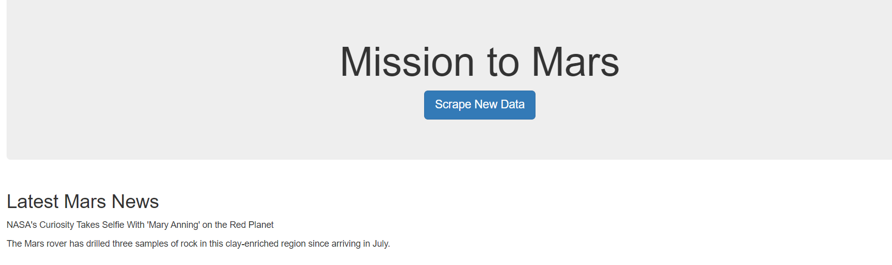
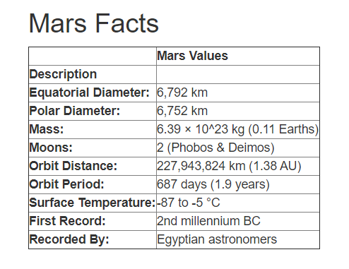

# Web Scraping - Mission to Mars

- - -

I built a web application that scrapes various websites for data related to the Mission to Mars and displays the information in a single HTML page. 

- - -

## Scraping

Did the initial scraping using Jupyter Notebook, BeautifulSoup, Pandas, and Requests/Splinter.

### NASA Mars News

* Scraped the [NASA Mars News Site](https://mars.nasa.gov/news/) and collected the latest News Title and Paragraph Text. 

### JPL Mars Space Images - Featured Image

* Visited the url for JPL Featured Space Image [here](https://www.jpl.nasa.gov/spaceimages/?search=&category=Mars).

* Used splinter to navigate the site and find the image url for the current Featured Mars Image and assigned the url string to a variable.

* Made sure to find the image url to the full size `.jpg` image.

* Made sure to save a complete url string for this image.

### Mars Facts

* Visited the Mars Facts webpage [here](https://space-facts.com/mars/) and used Pandas to scrape the table containing facts about the planet including Diameter, Mass, etc.

* Used Pandas to convert the data to a HTML table string.

### Mars Hemispheres

* Visited the USGS Astrogeology site [here](https://astrogeology.usgs.gov/search/results?q=hemisphere+enhanced&k1=target&v1=Mars) to obtain high resolution images for each of Mar's hemispheres.

* Saved both the image url string for the full resolution hemisphere image, and the Hemisphere title containing the hemisphere name. Used a Python dictionary to store the data.

* Appended the dictionary with the image url string and the hemisphere title to a list. This list will contain one dictionary for each hemisphere.

## MongoDB and Flask Application

Used MongoDB with Flask templating to create a new HTML page that displays all of the information that was scraped from the URLs above.

* Converted the Jupyter notebook into a Python script with a function that will execute all of the scraping code from above and return one Python dictionary containing all of the scraped data.

* Created a route called `/scrape` that imports the script and calls the `scrape` function.

  * Stored the return value in Mongo as a Python dictionary.

* Created a root route `/` that queries the Mongo database and passes the mars data into an HTML template to display the data.

* Created a template HTML file called `index.html` that takes the mars data dictionary and displays all of the data in the appropriate HTML elements. 

- - -
The data is provided by UCSD Extension: Data Science and Visualization Bootcamp.
- - -

Contact:

Email: arcebri1@gmail.com